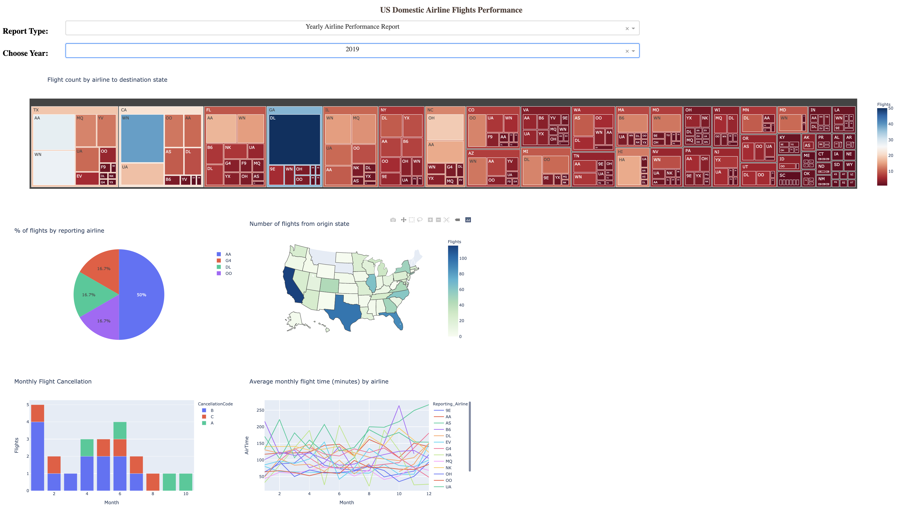
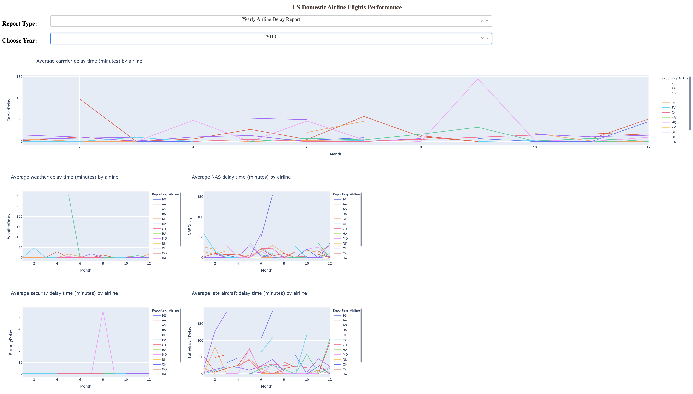
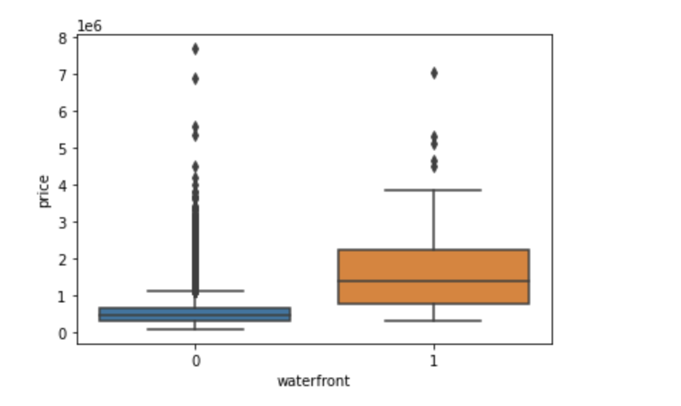
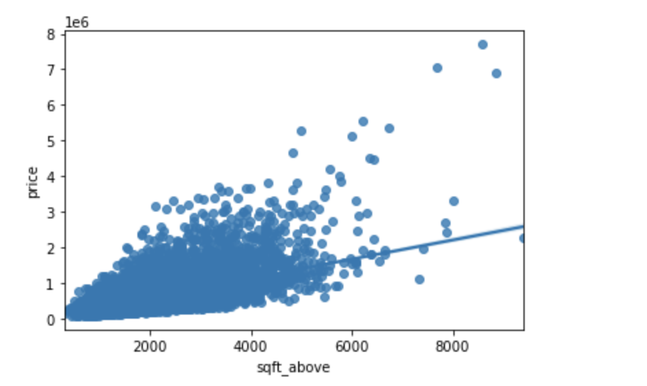

# Ibm Data Science assignments

## Dashboard powered by Dash (dash_2_dropdown_5_plot.ipynb)
An interactive dashboard provides real-time statistics based on the input(dropdown menus).
This dashboard provides two differnt types of reports: 

1.  Yearly airline performance report 

    For the chosen year provide,

    -   Number of flights under different cancellation categories using bar chart.
    -   Average flight time by reporting airline using line chart.
    -   Percentage of diverted airport landings per reporting airline using pie chart.
    -   Number of flights flying from each state using choropleth map.
    -   Number of flights flying to each state from each reporting airline using treemap chart.
       
    
      
     
2.  Yearly average flight delay statistics

    For the chosen year provide,

    -   Monthly average carrier delay by reporting airline for the given year.
    -   Monthly average weather delay by reporting airline for the given year.
    -   Monthly average natioanl air system delay by reporting airline for the given year.
    -   Monthly average security delay by reporting airline for the given year.
    -   Monthly average late aircraft delay by reporting airline for the given year.
       
    

   
## ibm_db_API.py

ibm_db_API.py connects to IBM DB2 cloud using Python Database API. The process involves creating a connection object, using the connection object to pass various queries, and retrieving result sets. Another method to access the database from the Jupyter notebook is by loading Jupyter extensions, SQL, and ibm_db_sa. In this method, there are fewer codes required to retrieve result sets. Another benefit is that it is easier to save the result sets to variables and convert them into Pandas dataframes. From there, plotting the result is just a few lines of code away.

#### Average Test Score/Country (palette='pastel')

#### Average Test Score/Country (palette=sns.color_palette("YlOrBr", n_colors=5))

   

## Data Analysis with Python.ipynb
This notebook showcases data analysis process with python, namely 
- Importing Data Sets
- Data Wrangling
- Exploratory Data Analysis
- Model Development
- Model Evaluation and Refinement

